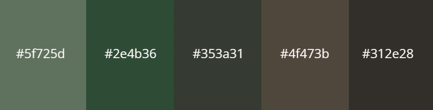

# The Dice Goblins Dungeon

[LINK TO THE LIVE PROJECT](https://leannebooden.github.io/mp1-dice-goblins-dungeon/)

## Table of Contents
---
**The Dice Goblins Dungeon**
- [Table of Contents](#the-dice-goblins-dungeon)
    - [Introduction](#introduction)
    - [UX](#ux)
        - [User Stories](#user-stories)
    - [Planning](#planning)
        - [Overview](#overview)
        - [Color Scheme](#color-scheme)
        - [Font](#font)
        - [Mock-ups](#mock-ups)
            - [Desktop](#desktop)
            - [Phone & Tablet](#phone--tablet)
    - [Features](#features)
        - [Navigation Bar](#navigation-bar)
        - [Home Page](#home-page)
            - [Hero Image](#hero-image)
            - [Welcome](#welcome)
            - [What is D&D?](#what-is-dd)
        - [About Me Page](#about-me-page)
            - [DM Style](#dm-style)
            - [Session 0](#session-0)
        - [Services Page](#services-page)
            - [Campaign Information](#campaign-information)
            - [Character Building](#character-building)
        - [Contact Page](#contact-page)
            - [Modal Pop-up](#modal-popup)
        - [Footer](#footer)
    - [Testing](#testing)
        - [Bug Fixes](#bug-fixes)
        - [Remaining Bugs](#remaining-bugs)
        - [Performance](#performance)
        - [Security](#security)
        - [W3S Jigsaw CSS Validator](#w3s-jigsaw-css-validator)
    - [Features Left to Implement](#features-left-to-implement)
    - [Deployment](#deployment)
        - [GitHub Pages](#github-pages)
        - [Forking the GitHub Repository](#forking-the-github-repository)
     - [Credits](#credits)
        - [Code](#credits)
        - [Content](#content)
        - [Media](#media)
        - [Other](#other)

## Introduction
---

The Dice Goblins Dungeon offers private Dungeon Master services (Game Master). This is a small business that runs Dungeons & Dragons games for clients online. The purpose of the site is to provide detailed information on the settings of the games and let potential clients know all about the Dungeon Master. A key goal is to sell both the games themselves, and the person running them.

The website includes an overview of the services offered, an about me section which provides details on the company owner who runs the sessions and a contact form. 

Within this document I will use the following abbreviations:
- D&D - Dungeons & Dragons
- DM - Dungeon Master / Game Master

[Link to the live page](https://leannebooden.github.io/mp1-dice-goblins-dungeon/)

## UX
---

### User Stories

| ID  | As a...          | I Want To Be Able To...                                     | So That I Can...                                            |
| --- | ---------------- | ----------------------------------------------------------- | ----------------------------------------------------------- |
| 01  | Potential Client | navigate the site quickly and efficiently.                  | identify the information I require about the service.       |
| 02  | Potential Client | discover what campaigns the DM offers                       | decide if the DM offers stories that I am interested in.    |
| 03  | Potential Client | easily contact the DM                                       | find out more information and register my interest.         |
| 04  | Potential Client | read about the DM running the sessions and their game style | find out if their play style matches what I am looking for. |
| 05  | Potential Client | see that the DM has wellbeing as a priority                 | feel safe playing in a game hosted by them.                 |

## Planning
---

### Overview
When planning the site, the above user stories were taken into account alongside the following goals of the site owner:

- Explain briefly what D&D is and why clients would want to play
- Provide information on the services offered
- Allow potential clients to reach out easily for more information or to book a session
- Provide some information on the DM and their style
- A focus on client wellbeing and comfort
- Ease of use
- Responsiveness for ease of use on different devices

Many of these goals align closely with the user stories identified earlier. The site owner goals additional to the User Stories were met with the following features. They are discussed in more detail in the [Features](#features) section below:

- A short description about D&D on the index page
- A detailed services page with the current campaign offered
- An easy to use, eye catching contact form
- A detailed section on the About Me page explaining what a session 0 is and how the DM conducts this
- Clean display avoiding cluttering, clear navigation bar
- The site has responsive design elements

### Color Scheme

As the site is for a fantasy game that revolves around exploration, we wanted the site to reflect this. An earthy color scheme was chosen to give the user the feel of being in a forest. Earth tones are generally considered to be friendly and inviting which is a good fit for the site. We used the following color palette:

Earth tones are complimented well with orange and red tones according to color theory, so these were the types of colors chosen for the other images on the site such as the banner at the top of the page on all pages except the index page. An off-white color was chosen for the text as it stood out well against the earthy background tones without being too harsh. 

### Font

Before selecting a font we researched commonly used fonts for readability. Roboto from Google Fonts was highly recommended. It is a good clean font that looks professional while remaining easily readable. This is the font selected for the majority of the text within the site. The other font used in the project is Caveat. It gives a handwritten feel which is ideal for a fantasy themed site while still being easily readable. This was used only for the site name to allow this to stand out without overusing the font. It was decided to only use these two fonts for good cohesion throughout the site.

### Mock-ups

I used [Figma](https://www.figma.com/) to create mock-ups before building the project to plan out the layout and the look of the site across different devices. The design takes into account the view on desktop, tablet and phone. The same design was used for phone and tablet as it worked well on both these screen sizes.

I decided on this approach rather than wireframes to allow for more thorough planning before beginning to build. There were no major changes between the planning and actual build. You can view the full mock-ups  by clicking the links below:

#### Desktop
- [Home Page](/assets/img/README/home-page-desktop.webp)
- [About Me](/assets/img/README/about-me-desktop.webp)
- [Services](/assets/img/README/services-desktop.webp)
- [Contact](/assets/img/README/contact-desktop.webp)
#### Phone & Tablet
- [Home Page](/assets/img/README/home-page-phone.webp)
- [About Me](/assets/img/README/about-me-phone.webp)
- [Services](/assets/img/README/services-phone.webp)
- [Contact](/assets/img/README/contact-phone.webp)

The mock-ups use lorem ipsum placeholder text, this text has been replaced with appropriate content in the actual build.

## Features
---
### Navigation Bar

 User can navigate to "Home", "About Me" and "Contact" from the navigation bar. This design was chosen as it is very clear and concise for users allowing them to quickly navigate the site. Clicking the logo on any page will bring you back to the home page. 

For the mobile site, a hamburger menu was used instead to save space and allow for a less cluttered navigation bar. Clicking the icon opens the full menu allowing users to navigate to any page.

### Home Page

All the sections on this page have background colors in keeping with the earthy color scheme. The images chosen for this page are fantasy themed, which is perfect to advertise the tabletop RPG theme.
#### Hero Image

An image of a goblin was chosen for the hero image. This ties into the title of the site and fits into the existing earthy color scheme. A translucent overlay was added to the image to allow the site title to stand out from the background. The design of this section was kept the same for mobile as it fitted well. 

#### Welcome

This section introduces the purpose of the site and provides some basic information on what D&D is. It was decided to keep this information brief as most users would have a basic level of understanding to be searching for a DM. This lists briefly the services offered to make it clear to first time visitors what they can expect. As most users only spend a few seconds on a site before deciding whether or not to read on, the key information is found in this section. 
#### What is D&D?

This section provides a basic explanation of what D&D is to those who may be new to the game. It also provides an example to help with understanding. This section was intentionally kept small as many visitors to the site will already be familiar with the game. The site owner regularly helps new players get into D&D so this was included to show both their knowledge of the game and help new players feel at ease. 

On mobile devices the layout is changed to display a text section followed by an image to improve readability and make the content look less cluttered. 
#### DM Style

This section provides information on the style of gameplay clients can expect. This is important information for a client to make sure they find a session that is compatible with their requirements as not every DM will suit every player. The aim is to provide plenty of information for clients to make informed choices. 
#### Session 0

This section discusses what a player can expect from a session 0. A session 0 is used to establish the boundaries of both the player and the DM. This is vital information for clients as it helps to create trust between clients and the DM even before starting to play. 
### About Me Page

The about me page continues with the earthy color scheme for site cohesion. The title of this page has a background with an image of a die. This image continues the color theme and is used on all pages except the index page to add to the site cohesion. There is an overview of the page content at the top to allow users to quickly identify the information they need to encourage them to read further. The photos chosen continue to portray the fantasy theme.  

On mobile devices the layout is changed to display a text section followed by an image to improve readability and make the content look less cluttered.
#### DM Style

This section provides information on the style of gameplay clients can expect. This is important information for a client to make sure they find a session that is compatible with their requirements as not every DM will suit every player. The aim is to provide plenty of information for clients to make informed choices. 
#### Session 0

This section discusses what a player can expect from a session 0. A session 0 is used to establish the boundaries of both the player and the DM. This is vital information for clients as it helps to create trust between clients and the DM even before starting to play. 
### Services Page

The introduction to the services follows the color theme already established and provides a summary of the services offered. There are clickable links to the campaigns allowing quicker navigation of the page.  There is also a link to the contact page within each section to further improve navigation. 

#### Campaign Information 

There are three sections that have an image alongside the text to further illustrate the theme of each campaign. The text alongside each section goes into more detail about each setting. This is the heart of the service being provided so it is vital information. The sections have bullet points lists at the top, providing some key information such as the genre so clients can quickly see which sections are of interest to them. There is then a more detailed introduction to each of the campaigns below.

On mobile view, the services layout is changed. An accordion is used to save screen space on these devices. 

#### Character Building

This section summaries the character building services offered. As this is a secondary service, this is displayed at the last section on the page to give priority to the more key elements. 

### Contact Page

A contact form to request more information about the services offered and/or to get in touch. The form does not request too much information, only the essentials as potential clients can be put off if asked to provide too much information up front. The name and email sections are required to ensure that enough information is collected to allow the site owner is able to contact potential clients.

#### Modal Popup

When clicking submit, a modal popup comes up confirming that the form has been submitted. A "Close" button can be seen at the bottom of the popup to allow the user to easy navigate back to the contact page. The popup fades the background, to draw the users eye to it.

### Footer

Features the logo and site name which link to the "Home" page. In the center there are links to "Facebook", "X or Twitter" and "Instagram". These external links open in a new tab so the user is not navigated away from the site. At present, the social media links go to the home pages of the sites in question. On the far right there is also a link to the contact page. The footer bar helps the user to navigate the site more easily.

On mobile devices, the site name is removed to save space on the footer and reduce cluttering.

## Testing
---
| ID | User Story | How was this acheieved? | Pass? |
|---|---|---|---|
|1| Navigate the site quickly and efficiently| Provided a clear navigation bar at the top and the ability to navigate to all pages from anywhere on the site. | YES |
|2| Discover what campaigns the DM offers | Services page that lists the campaigns on offer with detailed descriptions including details on the campaign length, genre and type of play. |YES |
|3| Easily contact the DM | Contact page with a form to provide the DM with contact information so they can speak with potential clients and answer questions. | YES |
|4| Read about the DM running the sessions and their game style | About me page has a section explaining what a session 0 will entail to help players feel comfortable. | YES |
|5| See that the DM has wellbeing as a priority | About me page has a section explaining what a session 0 will entail to help players feel comfortable. | YES |

### Bug Fixes

Bug: Encountered a bug with one navbar item dropping below the others. 

Solve: This was solved by adding font-size: 0; to the navcontainer.

Bug: The navbar text was not aligning with the logo image.

Solve: Used align-items: center; on the footer .row

Bug: On the Services page, the sections were displaying in the wrong order on smaller screens.

Solve: Added column-reverse to the containers of the sections that were displaying in the wrong order to reverse the order they display in. 

Bug: The logo image in the footer was displaying on top of the site name rather than in-line with. 

Solve: I discovered that the d-flex class I was using was from a previous bootstrap version and not applicable to version 5. I added display: flex to the container and the float: right; to the title and float: left; to the logo which allowed them to display correctly.

Bug: The vines image on the navbar was blocking the navitem functionality, meaning on certain screen sizes you were unable to click on the navlinks.

Solve: Added z-index values to both the vines image and the navbar a items. By setting the z-index of the vines lower than the a items, this layered them correctly allowing the links to be clicked.

Bug: The section headers were appearing next to the content rather than on top of.

Solve: I added a flex-direction: column; to the container.
### Remaining Bugs 

One remaining bug identified, small amount of whitespace between accordions and images on small screens.

### Performance

Testing performance using Lighthouse within Google Chrome Developer Tools indicted high ratings for performance, accessibility, best practices and SEO.

### Security

The security of the website was tested using the security section of Google Chrome Developer tools.

#### W3S Jigsaw CSS Validator

Ran code through The W3S Jigsaw CSS Validator. Initially, showed the following error when validating the CSS code:

Fixed this error by removing the unecessary value and type attributes from the freetext element on the contact page. All pages returned with no errors. 

## Features Left to Implement
---

The following are features that will be implemented in the future but were beyond the scope of this particular project:

* A section on the home page with details of new campaigns the DM is running to appeal to returning clients. 
* The Contact form information at present does not go anywhere. In future, this would connect with the DM's email address instead.
* The social media links at present only link to the main pages of the sites, in future this will instead be linked to the pages of the company
* The logo will be changed as the company owner is still designing this. A placeholder logo that was deemed appropriate was used for this project.
* Another page would be added to include the table rules and cancellation policy 

## Technologies Used
---

- [VS Code](https://en.wikipedia.org/wiki/Visual_Studio_Code)

    Code Editor

- [GitHub](https://github.com/)

    Code Repository and Deployment

- [git](https://www.git-scm.com/)

    Version Control and Deployment

### Languages Used

- [HTML5](https://en.wikipedia.org/wiki/HTML5)

- [CSS3](https://en.wikipedia.org/wiki/CSS)

- [JavaScript](https://en.wikipedia.org/wiki/JavaScript)

### Frameworks, Libraries & Programs Used

* [The W3C Markup Validator](https://validator.w3.org/#validate_by_input) has been used to validate the html code.
* [The W3C Jigsaw CSS Validator](https://jigsaw.w3.org/css-validator/) has been used to validate the CSS code.
* [JShint](https://jshint.com/) has been used to validate the JavaScript code.
* [Bootstrap](https://getbootstrap.com/) V5 has been used for the navigation bar, the footer, the accordions on the services page and the modal pop-up on the contact page.
* [Procreate](https://procreate.com/) has been used to draw the vines art in the header and edit the site logo
* [befunky](https://www.befunky.com/) has been used to edit the images
* [Figma](https://www.figma.com/) has been used to create the site mock-ups
* [ChatGPT](https://en.wikipedia.org/wiki/ChatGPT) used to generate a logo base design
* [Coolors](https://coolors.co/) used to find a suitable color palette
---

- [VS Code](https://en.wikipedia.org/wiki/Visual_Studio_Code)

    Code Editor

- [GitHub](https://github.com/)

    Code Repository and Deployment

- [git](https://www.git-scm.com/)

    Version Control and Deployment

### Languages Used

- [HTML5](https://en.wikipedia.org/wiki/HTML5)

- [CSS3](https://en.wikipedia.org/wiki/CSS)

- [JavaScript](https://en.wikipedia.org/wiki/JavaScript)

### Frameworks, Libraries & Programs Used

* [The W3C Markup Validator](https://validator.w3.org/#validate_by_input) has been used to validate the html code.
* [The W3C Jigsaw CSS Validator](https://jigsaw.w3.org/css-validator/) has been used to validate the CSS code.
* [JShint](https://jshint.com/) has been used to validate the JavaScript code.
* [Bootstrap](https://getbootstrap.com/) V5 has been used for the navigation bar, the footer, the accordions on the services page and the modal pop-up on the contact page.
* [Procreate](https://procreate.com/) has been used to draw the vines art in the header and edit the site logo
* [befunky](https://www.befunky.com/) has been used to edit the images
* [Figma](https://www.figma.com/) has been used to create the site mock-ups
* [ChatGPT](https://en.wikipedia.org/wiki/ChatGPT) used to generate a logo base design
* [Coolors](https://coolors.co/) used to find a suitable color palette

## Deployment

### GitHub Pages

The project was deployed to GitHub Pages. The following steps are used to deploy the site:
* Navigate to GitHub and locate and select the GitHub repository.
* Navigate to the settings tab and select the 'Pages' tab from the menu.
* Under 'Source' click the dropdown labelled 'None' and select the 'master' branch.
* Click save. The page will automatically refresh and the published site link can be found on the 'Pages' tab.
* The link can be found here - (link to live site)

### Forking the GitHub Repository

The following steps can be used to fork the GitHub repository:
* On GitHub navigate to the main page of the repository.
* The 'Fork' button can be found on the top righthand side of the screen.
* Click the button to create a copy of the original repository.

### Cloning the GitHub Repository

The following steps can be used to clone the GitHub repository:
* On GitHub navigate to the main page of the repository.
* Above the list of files select 'Code'.
* Three options are provided, HTTPS, SSH and GitHub CLI. Select the appropriate option and click the 'Copy' button next to the URL.
* Open Git Bash.
* Change the working directory to the location for the cloned directory.
* Type git clone and paste the copied URL.
* Press 'Enter' to create the clone.

### GitHub Pages

The project was deployed to GitHub Pages. The following steps are used to deploy the site:
* Navigate to GitHub and locate and select the GitHub repository.
* Navigate to the settings tab and select the 'Pages' tab from the menu.
* Under 'Source' click the dropdown labelled 'None' and select the 'master' branch.
* Click save. The page will automatically refresh and the published site link can be found on the 'Pages' tab.
* The link can be found here - [Link to the live page](https://leannebooden.github.io/mp1-dice-goblins-dungeon/)

### Forking the GitHub Repository

The following steps can be used to fork the GitHub repository:
* On GitHub navigate to the main page of the repository.
* The 'Fork' button can be found on the top righthand side of the screen.
* Click the button to create a copy of the original repository.

### Cloning the GitHub Repository

The following steps can be used to clone the GitHub repository:
* On GitHub navigate to the main page of the repository.
* Above the list of files select 'Code'.
* Three options are provided, HTTPS, SSH and GitHub CLI. Select the appropriate option and click the 'Copy' button next to the URL.
* Open Git Bash.
* Change the working directory to the location for the cloned directory.
* Type git clone and paste the copied URL.
* Press 'Enter' to create the clone.

## Credits

I want to give thanks to the following people who have aided in some way with this project:
- Excellence Ilesanmi - mentor
- Manuel Perez Romero - tutor
- Slack Users: Sherry, Luke, Kera, Jaimie, Sasan & Mike for answering questions I had and providing valuable insight.
- Tutors from Code Institute for help and guidance

### Code

- [Stack Overflow](https://stackoverflow.com/questions/66335238/changing-the-color-arrow-in-bootstrap) - Used a section of code to change the color of the dropdown arrows on the accordion
- [Chat GPT](https://en.wikipedia.org/wiki/ChatGPT) - Used for a section of Javascript code to load the modal pop-up after the page reload.
### Content

* [Font Awesome](https://fontawesome.com/) - for the social media icons and arrows
* [Google Fonts](https://fonts.googleapis.com/css2?family=DM+Serif+Display:ital@0;1&display=swap) - Roboto and Caveat
### Media

- [Pixabay](https://pixabay.com/) - used for copyright free images
- [Pexels](https://www.pexels.com/) - used for copyright free images

### Other

* [Ami I Responsive?](https://ui.dev/amiresponsive) Testing the Responsive design of the Website.